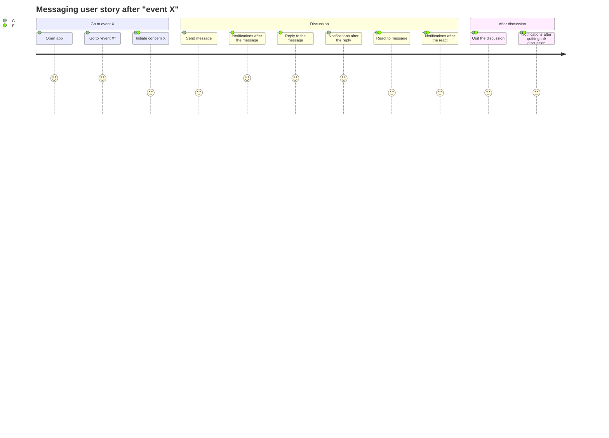

- Why music streaming services don't build a stuff that will lower volume down when someone want to talk, or listen to "music stop" like a physical alexa when users want to stop, and gradually increase volume when it is damn quite.
	- like Slack huddle auto mute
- https://github.com/getsentry/sentry-ruby/commit/9eb25f8f66fab3f5a02e6b70f44accbf78dc94b3 
	- the background worker implementation @ sentry 4.1 that made it stayed away from async
- https://nebulab.com/blog/actioncable-vs-anycable-fight
	- https://github.com/nebulab/rails-websocket-bench/blob/master/tsung.xml
	- Load testing with tsung https://www.thegreatcodeadventure.com/load-testing-rails-5-action-cable-with-tsung/
- https://docs.nats.io/nats-concepts/core-nats/pubsub

https://mermaid-js.github.io/mermaid/#/user-journey

https://mermaid-js.github.io/mermaid/#/gitgraph this is cool too
https://mermaid-js.github.io/mermaid/#/c4c omg, interaction diagram
https://mermaid-js.github.io/mermaid/#/examples
- pie chart duh