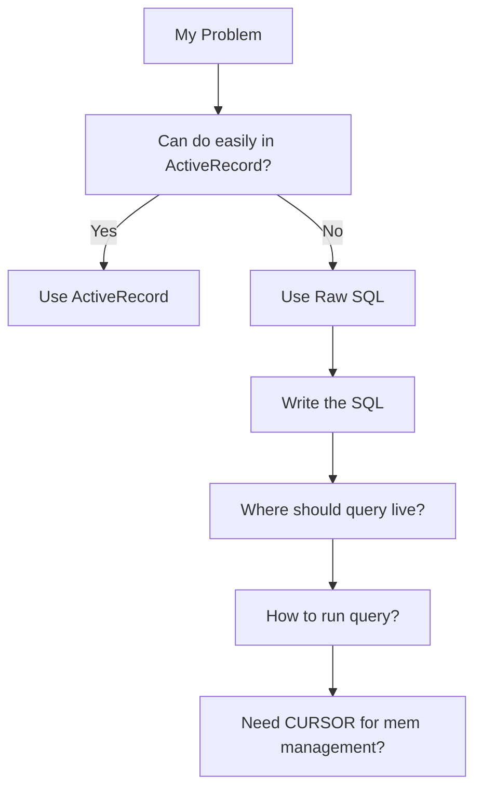

- https://plato.stanford.edu/entries/japanese-zen/
- https://plato.stanford.edu/entries/vagueness/ "If you cut one head off of a two-headed man, have you decapitated him? What is the maximum height of a short man? When does a fertilized egg develop into a person? These questions are impossible to answer because they involve absolute borderline cases"
- https://github.com/ruby/ruby/blob/master/doc/extension.rdoc
- https://github.com/eoinkelly/rails-raw-sql-guide?tab=readme-ov-file#appendix-avoiding-excessive-memory-usage-with-a-cursor prime guide
- Well, regarding AI adoption, we should not focusing on tools or models because it is crazy, we must focus on agent-platform and context to solve real problems. AI-assisting human is just a yellow
- https://world.hey.com/dhh/servers-can-last-a-long-time-165c955c tell me why Google Photos and other hosting services are still expensive af, while disks are ultra-cheap at the moment, x-opoly?
- https://www.linkedin.com/posts/kentbeck_how-much-does-this-brick-weigh-2-kilos-activity-7290847875381575680-XTHA?utm_source=share&utm_medium=member_desktop&rcm=ACoAABfZmikB1Bxn9NAEt034yXkdpzkaFnkA9rg

