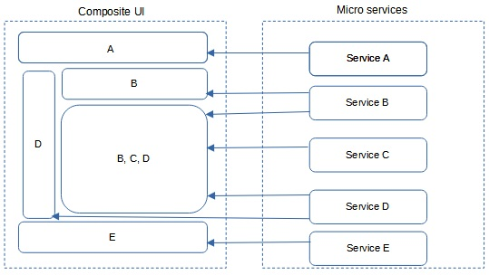
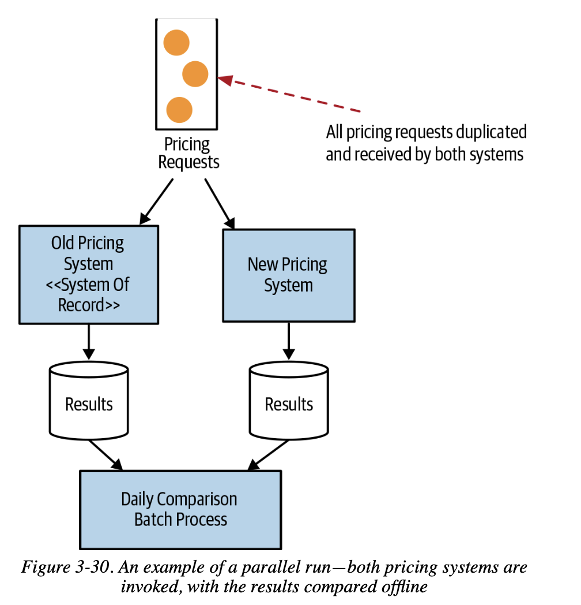
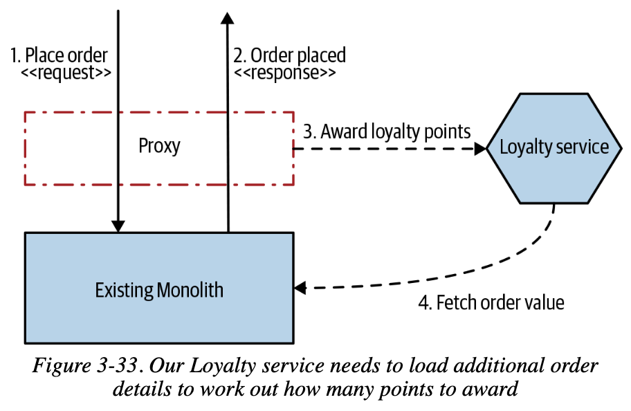
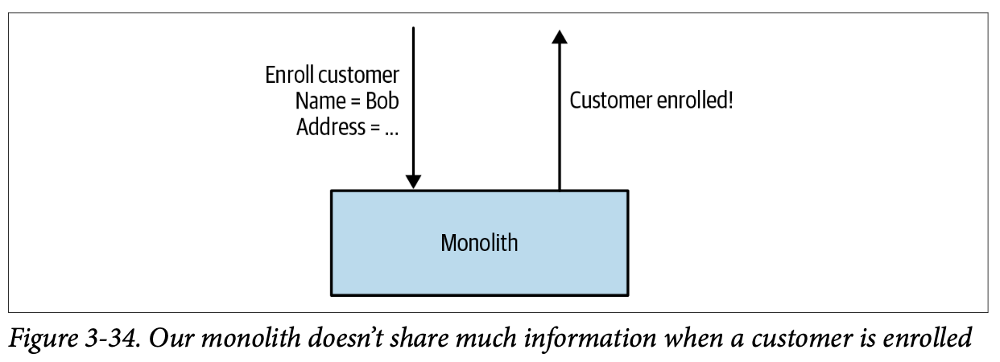
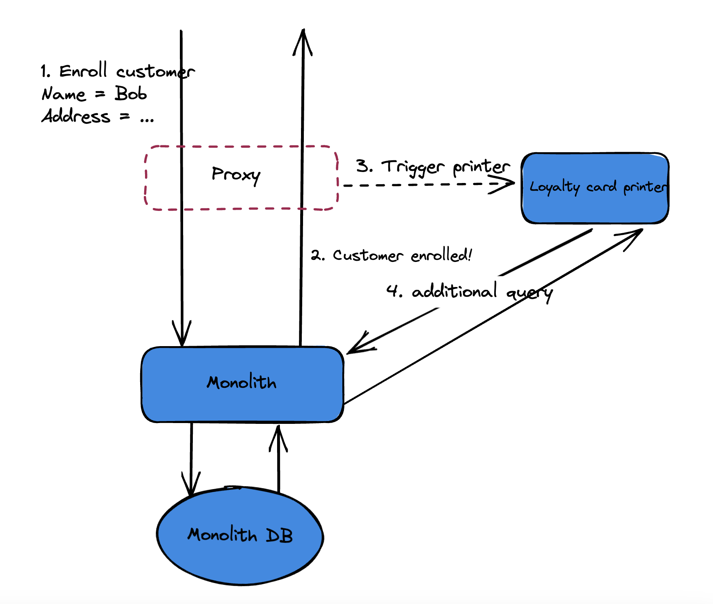
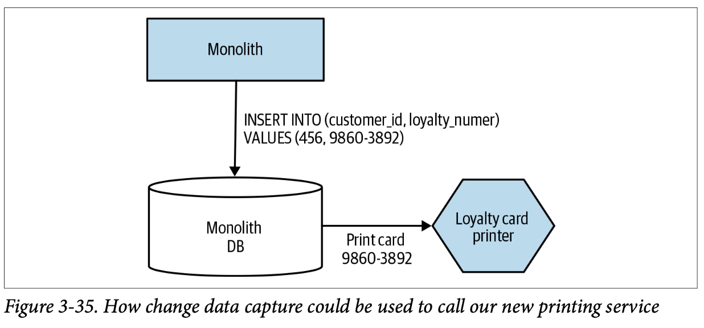
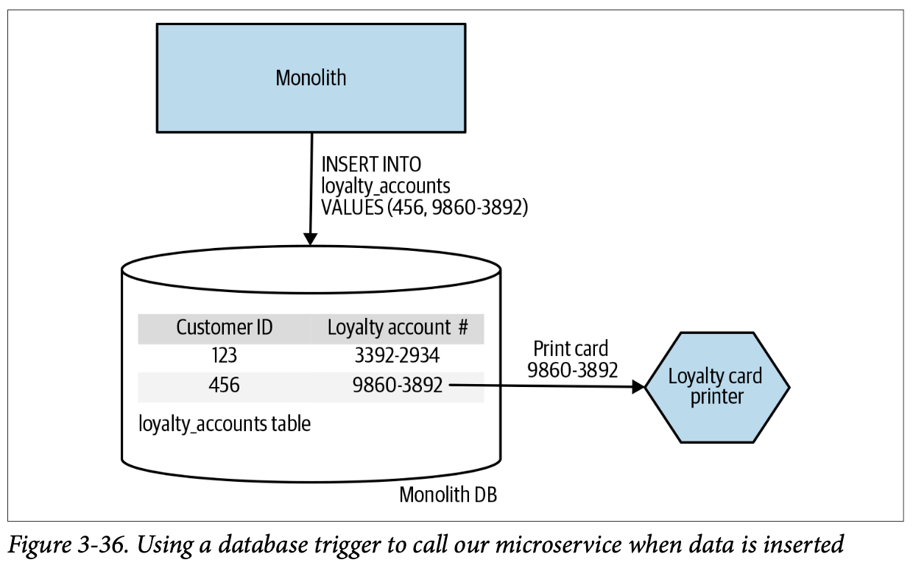
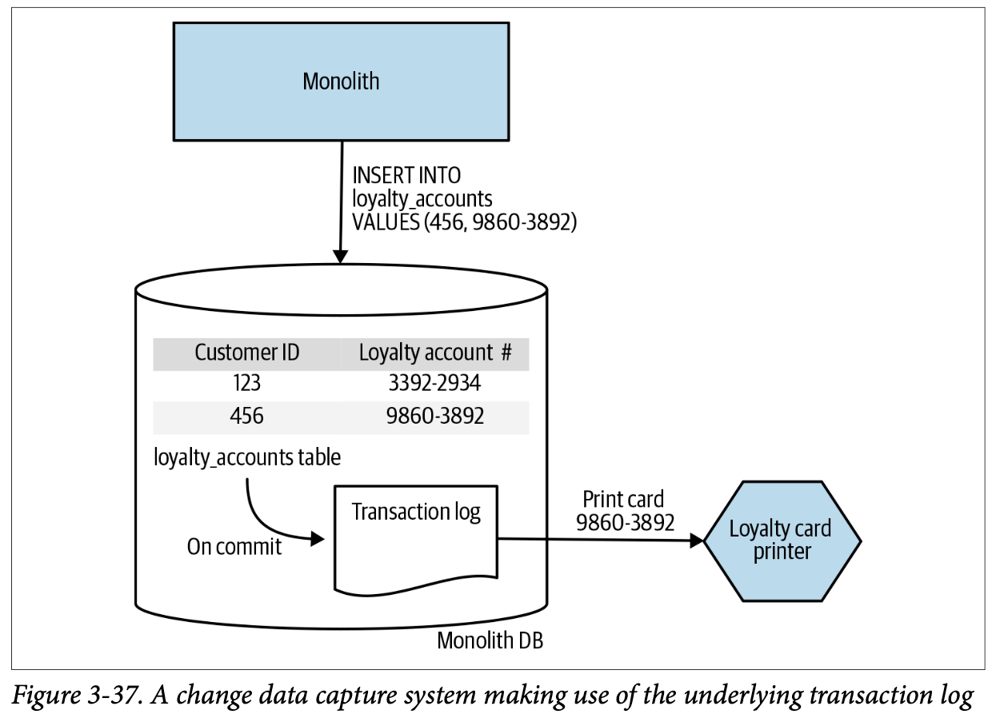

----

# Today's agenda

 re:Previous patterns
 Pattern: Parallel Run
 Pattern: Decorating Collaborator
 Pattern: Change Data Capture (CDC)
 Q/A

----
<!-- _class: lead -->

# re:Previous patterns

-----
## re: Strangler Fig

"Big-bang migration" ❌  
"Incremental rewrites" ✅

---- 

Don't use when
-   When requests to the back-end system cannot be intercepted.
-   For smaller systems where the complexity of wholesale replacement is low.

----
## re: UI composition

Don't use when
- The UI is simple 
- The cost of maintenance separated UI is high

----
## re: Branch by abstraction

Don't use when
- The change is not deep inside the functionality
- Having feature flag -> not necessary
- Bad ownership model: Team introducing code conflicts, duplication
----
<!-- _class: lead -->

# Pattern: Parallel Run

----

### Definition

Problem: You want canary releases to beta users

Both old and new implementation are run at the same time to _mitigate the risk_ of switching to a new service.

Terms: Soft launch, dark launch, canary release, beta testing

----

### **Example:** Credit Derivative Pricing

Involve money 💰

-----
### Pros

- Incremental rollout to reduce risk
- Early feedback: beta user can report issues
- Blast radius control

----
### Cons

It is **powerful**, however there are drawbacks
- High complexity: need extra tools to segment users with opt-in, opt-out and manage targeted features
- Higher cost of maintenance: maintain 2 implementations at a time is time consuming
- Confuse user due to poor management

----
<!-- _class: lead -->

# Pattern: Decorating Collaborator

----
### Definition

Problem: new features during spinning off a service away from monolith. Want to change behavior without modification to the existing code.

Attach something that the legacy downstream knows nothing about it  
1.  allow the call to primary service (A)
2.  based on the result -> call to external microservice (B) (concept: callback)

----
### **Example:** Loyalty Program of Music Corp

Module `Order` is a legacy module, however we want to add `Loyalty` service

----
### Pros

- Very flexible to change the behavior without modify the existing implementation
- Separation of concerns
- Easy to maintain

----
### Cons

- Tight coupling: abusing the decorator may make it less reusable, eventually becomes a bigger module
- Less visible: hard to know the flow
- Lag as the decorator becomes critical path no matter how the behavior is

----
### Quiz

Given the Music Corp example, why not moving the callback logic to frontend?

----
<!-- _class: lead -->

# Pattern: Change Data Capture

----

### Definition

Rather than trying to intercept and act on calls made into the monolith, we react to changes made in a datastore.

The underlying capture system has to be coupled to the monolith’s datastore

-----

### **Example:** Issuing Loyalty Cards

💡 Use decorating collaborator to trigger Loyalty card printer at proxy level.

-----

### **Example:** Issuing Loyalty Cards

❌ Need to make an addition call to Monolith to query more data

------
### **Example:** Issuing Loyalty Cards

With change data capture
-   Reduce network round trip 
-   Don’t need to touch monolith codebase

-----

### Implementations: DB trigger

Although there may also be limitations as to what these triggers can do, some DBMS allow to call web services or custom code (Ex: Oracle support Java code for DB triggers)

-----

### Implementations: DB trigger

Pros:
- Quite simple implementation

Cons:
- Using triggers make system harder to understand
- Tougher data change management
- “Having one or two database triggers isn’t terrible. Building a whole system off them is a terrible idea.”

-----

### Implementations:  Transaction log pollers

Inside most databases, certainly all mainstream transactional databases, there exists a transaction log. This file records all data changes.

-----

### Implementations:  Transaction log pollers

Pros:
- Have a huge array of support built tools exist.
- The tools may support to place messages onto message broker => useful for async behavior
- Can run off a replica of the transaction log => fewer concerns regarding coupling or contention.

Cons:
- Add significant complexity to your solution
-----
### Implementations:  Batch delta copier

Build a schedule job scanning and handling new data changes

Pros:
- The most simplistic approach

Cons:
- Have to manage timestampt or the last captured row
- Stale data

-----

<!-- 
_class: lead invert 
_transition: in-out
-->

# Q/A

---- 

<!-- 
_class: invert 
_transition: in-out
-->

## Quiz:

----

## Miscs
- https://www.confluent.io/learn/change-data-capture/
	- https://github.com/confluentinc/demo-database-modernization
- https://danlebrero.com/2022/02/09/monolith-to-microservices-summary/#ch-3
- https://launchdarkly.com/blog/canary-release-is-the-new-beta/