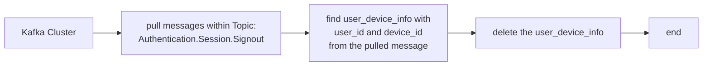

## Say hello to Obsidian
- [ ] Hello
	- it does not need to be a todo nested inside a todo
- I can turn on live preview/ or reading
- Remember there are backlinks at @mention and link
	- Let's create a graph dependency to visualize the relationship better than any words
- As markdown, it can play well with mermaidjs

- :trophy: emojis, let's see
- github / source versioning friendly 
	- ga . && gcsm "$(date +%Y%m%d-%H:%M:%S%Z)"
	- `https://github.com/ohmyzsh/ohmyzsh/blob/master/plugins/git/git.plugin.zsh`